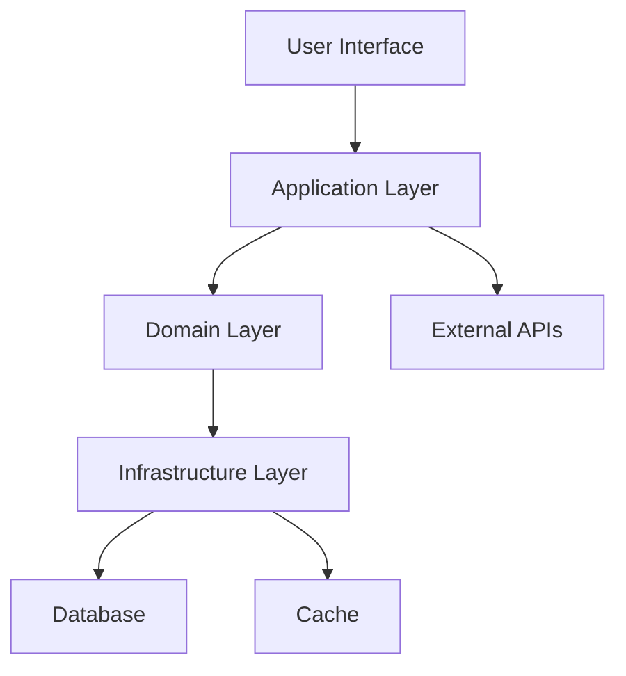

# 2024年のキャリア振り返り

2024年が終わりに近づく中で、この一年間のエンジニアとしての成長と学びを振り返ってみました。技術面だけでなく、働き方やチームワークについても考察します。

## 技術的な成長

### 1. フロントエンド技術の深化

**React / Next.js**

今年は特にReactエコシステムの理解を深めることができました。

- **App Router**: Next.js 13のApp Routerに本格移行
- **Server Components**: サーバーサイドレンダリングの最適化
- **Suspense**: ローディング状態の改善
- **Error Boundaries**: エラーハンドリングの向上

```typescript
// App Routerでの実装例
export default async function BlogPost({ params }: { params: { slug: string } }) {
  const post = await getPost(params.slug);

  return (
    <article>
      <h1>{post.title}</h1>
      <div>{post.content}</div>
    </article>
  );
}
```

**TypeScript**

TypeScriptの活用レベルが格段に向上しました。

- **Generic Types**: 再利用可能な型定義
- **Utility Types**: Partial、Pick、Omitの活用
- **Conditional Types**: 条件付き型の理解
- **Template Literal Types**: 文字列型の操作

### 2. バックエンド技術への挑戦

今年はフロントエンドだけでなく、バックエンド技術にも積極的に取り組みました。

**Node.js / Express**

```typescript
// RESTful APIの実装
app.get('/api/posts/:id', async (req, res) => {
  try {
    const post = await getPostById(req.params.id);
    res.json(post);
  } catch (error) {
    res.status(500).json({ error: 'Internal Server Error' });
  }
});
```

**データベース設計**

- **PostgreSQL**: リレーショナルデータベースの設計
- **Prisma**: ORMを使ったデータ操作
- **Redis**: キャッシュシステムの導入

### 3. DevOps / インフラ

**コンテナ技術**

```dockerfile
FROM node:18-alpine

WORKDIR /app

COPY package*.json ./
RUN npm ci --only=production

COPY . .
RUN npm run build

EXPOSE 3000
CMD ["npm", "start"]
```

**CI/CD**

GitHub Actionsを使った自動化パイプラインの構築を学びました。

```yaml
name: Deploy
on:
  push:
    branches: [main]

jobs:
  deploy:
    runs-on: ubuntu-latest
    steps:
      - uses: actions/checkout@v3
      - uses: actions/setup-node@v3
        with:
          node-version: '18'
      - run: npm ci
      - run: npm run build
      - run: npm run test
```

## プロジェクト管理と協働

### 1. アジャイル開発の実践

**スクラム**

- **スプリント計画**: 2週間スプリントでの開発
- **デイリースタンドアップ**: 毎日の進捗共有
- **レトロスペクティブ**: 改善点の洗い出し

**タスク管理**

- **ユーザーストーリー**: 要件をユーザー視点で整理
- **ストーリーポイント**: 見積もりの精度向上
- **バーンダウンチャート**: 進捗の可視化

### 2. コードレビューの質向上

**レビューで意識したポイント**

- **可読性**: コードの意図が明確か
- **保守性**: 将来の変更に対応できるか
- **パフォーマンス**: 不要な処理がないか
- **セキュリティ**: 脆弱性のリスクはないか

**建設的なフィードバック**

```markdown
# コードレビューコメントの例

## Good

- エラーハンドリングが適切に実装されている
- 型定義が明確で理解しやすい

## Suggestion

- この関数は複雑すぎるので、より小さな関数に分割することを検討してみてください
- パフォーマンスを考慮して、メモ化を検討してみてはいかがでしょうか

## Question

- この実装の意図について教えてください
```

## 学習方法の進化

### 1. 体系的な学習

**書籍から学ぶ**

- 「リーダブルコード」: コード品質の向上
- 「Clean Architecture」: アーキテクチャ設計
- 「Team Geek」: チームワークの重要性

**オンライン学習**

- **Udemy**: 実践的なコース受講
- **Coursera**: 大学レベルのCS基礎
- **YouTube**: 最新技術のキャッチアップ

### 2. 実践的な学習

**個人プロジェクト**

```typescript
// ブログシステムの開発
interface BlogPost {
  id: string;
  title: string;
  content: string;
  publishedAt: Date;
  tags: string[];
}

class BlogService {
  async createPost(postData: Omit<BlogPost, 'id'>): Promise<BlogPost> {
    // 実装
  }

  async getPostsByTag(tag: string): Promise<BlogPost[]> {
    // 実装
  }
}
```

**オープンソース貢献**

- **バグ修正**: 小さなissueから始めて貢献
- **ドキュメント改善**: READMEやコメントの改善
- **機能追加**: 新機能の提案と実装

## 働き方の変化

### 1. リモートワークの最適化

**環境整備**

- **作業環境**: デュアルモニター、エルゴノミクスチェア
- **コミュニケーション**: Slack、Zoom、Notionの活用
- **時間管理**: ポモドーロテクニックの実践

**集中力の向上**

```markdown
# 日々のルーティン

## 午前 (9:00-12:00)

- 最も集中力が必要なタスク
- コーディング、設計作業

## 午後 (13:00-17:00)

- ミーティング、コードレビュー
- ドキュメント作成

## 夕方 (17:00-19:00)

- 学習時間、技術記事執筆
```

### 2. ワークライフバランス

**健康管理**

- **定期的な運動**: 週3回のジョギング
- **十分な睡眠**: 7-8時間の睡眠確保
- **ストレス管理**: 瞑想、読書

**継続的な学習**

- **技術ブログ**: 月2回の記事投稿
- **勉強会参加**: オンライン勉強会への参加
- **資格取得**: AWS認定資格への挑戦

## 2024年の主な成果

### 1. プロジェクトでの貢献

**Webアプリケーションの新規開発**

- **技術スタック**: Next.js, TypeScript, PostgreSQL
- **期間**: 6ヶ月
- **成果**: ユーザー満足度90%以上

**既存システムのモダナイゼーション**

- **Legacy React**: Class ComponentからHooksへ移行
- **JavaScript**: TypeScriptへの段階的移行
- **成果**: バグ件数50%削減

### 2. チームへの貢献

**技術選定での主導**

- **フロントエンド**: React Server Componentsの導入
- **テスト**: PlaywrightによるE2Eテスト導入
- **開発環境**: TurboRepoによるモノレポ化

**知識共有**

- **勉強会開催**: 月1回の技術勉強会
- **メンタリング**: 新人エンジニアの指導
- **ドキュメント整備**: 開発ガイドラインの作成

## 課題と反省

### 1. 技術的な課題

**設計スキル**

まだまだアーキテクチャ設計のスキルが不足していると感じます。

- **課題**: 大規模システムの設計経験不足
- **対策**: Clean Architectureの学習を深める

**パフォーマンス最適化**

```typescript
// 改善前（問題のあるコード）
function getUserPosts(userId: string) {
  const user = users.find(u => u.id === userId);
  const posts = allPosts.filter(p => p.authorId === userId);
  return { user, posts };
}

// 改善後（最適化されたコード）
const userPostsCache = new Map();

function getUserPosts(userId: string) {
  if (userPostsCache.has(userId)) {
    return userPostsCache.get(userId);
  }

  const user = users.find(u => u.id === userId);
  const posts = allPosts.filter(p => p.authorId === userId);
  const result = { user, posts };

  userPostsCache.set(userId, result);
  return result;
}
```

### 2. ソフトスキルの課題

**コミュニケーション**

- **課題**: 技術的な内容を非エンジニアに説明する力
- **対策**: プレゼンテーション能力の向上

**時間管理**

- **課題**: 見積もり精度の向上
- **対策**: 過去データの分析と改善

## 来年への展望

### 1. 技術的な目標

**フルスタック開発**

- **フロントエンド**: React、Vue.jsの習得
- **バックエンド**: Go、Rustの学習
- **インフラ**: Kubernetesの実践経験

**アーキテクチャスキル**



### 2. キャリア目標

**技術リーダーシップ**

- **技術選定**: プロジェクトの技術選定に主体的に関与
- **アーキテクチャ**: システム設計をリードする
- **メンタリング**: チームメンバーの成長支援

**社外活動**

- **技術記事**: 月4回の記事投稿
- **登壇**: 技術カンファレンスでの発表
- **OSS貢献**: メジャープロジェクトへの貢献

## まとめ

2024年は技術的にもキャリア的にも大きく成長できた年でした。

### 成長できたポイント

1. **技術の幅の拡大**: フロントエンドからバックエンドまで
2. **チームワーク**: 協働スキルの向上
3. **継続的学習**: 体系的な学習習慣の確立
4. **アウトプット**: 技術記事や勉強会での発信

### 来年に向けて

技術力の向上とともに、チームや組織への貢献も意識していきたいと思います。

- **深い専門性**: 特定領域での専門家を目指す
- **広い視野**: ビジネス観点での技術判断
- **人材育成**: 次世代エンジニアの育成
- **技術コミュニティ**: より積極的な貢献

エンジニアとして、また一人の人間として、来年もさらなる成長を続けていきます。
